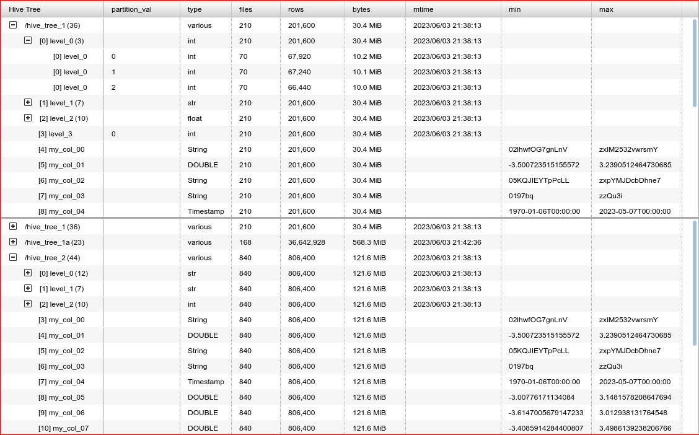

This notebook implements a Jupyter widget to compare Hive-partitioned Parquet tree metadata.  The widget is based on [ipyaggrid](https://widgetti.github.io/ipyaggrid/).  The purpose of this widget is to compare output result sets from things like various Dask graph runs: 

Read the detailed documentation in the [html export](https://mister-average.github.io/parquet_tree_browser_using_ipyaggrid/parquet_tree_browser_using_ipyaggrid.html) of the notebook.
